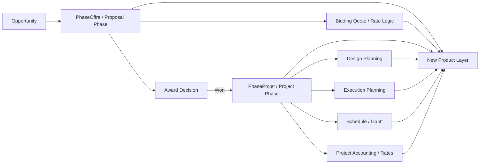

# Resource And Capacity Planning Product Research

## Purpose

This document connects three things:

1. What the client described in the discovery discussion.
2. What already exists in FocusGP / FNX today that we can reuse.
3. What the market already offers, so the new product solves the client's pain in a way that feels familiar but still better.

The goal is not to describe a generic resource planning tool. The goal is to define a product that the client recognizes immediately as solving their real problem:

- "We apply for 10 tenders and win 5."
- "Senior Engineers decide the hours by activity and by role."
- "Mechanical and Electrical teams plan separately in Excel."
- "We need collaboration between departments."
- "We are afraid of rigid tools during bidding because we still need to bend the rules to win."

That means the product has to do two things at the same time:

- become the shared system for activity, resource, and capacity planning;
- avoid becoming a rigid bidding engine that users feel forced to obey.

---

## Executive View

The strongest conclusion from the current codebase is this:

**we already have most of the project, proposal, budget, phase, rate, employee, and schedule data needed to build this product.**

What we do **not** have is the one layer the client currently keeps in Excel:

**Discipline -> Activity -> Role -> Hours -> Time-phased allocation**

Today FNX already knows:

- which proposal exists;
- which project phase exists;
- the budget, fees, and cost targets;
- the start and end dates;
- the employees and employee classes;
- the rate cards and markup logic;
- whether a proposal was awarded;
- the high-level schedule and progress;
- some design/execution planning context.

But FNX does **not** yet know, in a structured way:

- which Mechanical activities make up a tender;
- which Electrical activities make up a tender;
- how many Senior Engineer vs Junior Engineer hours were assumed for each activity;
- how that work should be spread over weeks or months;
- how tentative proposal demand competes with committed project delivery demand.

That is the product gap.

---

## The Client Problem In Product Terms

The client discussion points to five distinct jobs-to-be-done.

### 1. Bid-to-delivery continuity

The client does not want proposal planning and delivery planning to live in separate worlds.

Current reality:

- bid teams estimate in Excel;
- delivery teams later re-plan again;
- knowledge is lost between winning the work and staffing the work.

Product implication:

The new product should carry the planning structure from tender stage into execution stage instead of restarting from zero after award.

### 2. Activity-level effort planning

The client does not think in only project totals. They think in:

- discipline;
- activity;
- role split;
- required hours.

Product implication:

The product needs an activity breakdown model, not just project totals and dates.

### 3. Individual capacity planning across departments

The client explicitly called out collaboration issues between departments.

Product implication:

The product must expose a cross-department availability and overload view, not just a project-centric screen.

### 4. Proposal flexibility under market pressure

The client said the team often needs to break standard rules on average rate and salary assumptions to stay competitive.

Product implication:

The product must support judgment, overrides, and scenario planning. It cannot feel like an inflexible pricing robot.

### 5. Full funnel capacity, not just won work

The client does not only spend effort on the 5 won projects. They also spend effort preparing the 10 tenders.

Product implication:

The product must distinguish between:

- committed demand from awarded work;
- tentative demand from active proposals;
- bid-preparation demand before award.

---

## What Already Exists In FocusGP / FNX That We Can Reuse

This section is the main bridge between the client's pain and the current product.

## Current System Map

The current system already has strong anchors at proposal, project, planning, accounting, and schedule levels. The new product should sit across them, not beside them.

### Reusable capabilities by client pain area

| Client pain / need | What exists today | Why it matters | What is still missing |
| --- | --- | --- | --- |
| Need strict budgets and dates in system of record | `PhaseProjectVM` stores `BudgetHonoraires`, `BudgetHeures`, `DateDebut`, `DateFin`; schedule feature updates gantt dates and progress | We already have the financial and date guardrails the client wants enforced | No activity-level breakdown showing how those hours are composed |
| Need proposal funnel visibility | `PhaseOffreVM` stores `ProposalBudget`, `ProjectCost`, `ProjectFees`, `ContratOctroye`, `TransfromeEnProjet` | We already capture proposal economics and award outcome | No connection between proposal effort and downstream staffing demand |
| Need role-based effort planning | `BiddingManpowerClass`, `BiddingManpowerRateMaster`, `BiddingQuoteFees` already model role classes and hours-like quantities | This is the closest existing analog to the Excel sheet | Missing discipline + activity layer and time phasing |
| Need staffing and rates by employee | `EmployeeRates`, `RateByEmployeeClass`, `ProjectAccountingEmployeeRates`, phase employee-rate UI | We already know how to attach employees and class rates to work | No weekly capacity allocation or utilization model |
| Need schedule-based visibility | Schedule module stores per-phase dates and progress | Good base for time-phased planning | Too high-level for discipline/activity planning |
| Need design and execution planning | `PlanificationConception`, `PlanificationDiscipline`, `Plannification`, `PlannificationEmployee`, `LinkPlannificationActivity` | We already capture planning context and team responsibilities | Activities are currently checklist-style, not effort-quantified |
| Need collaboration and control | approvals, transaction history, friendly field-name mapping, approval status model, audit tables | We can build on existing trust, audit, and approval patterns | No planning-specific collaboration model yet |

---

## Detailed Reusable Assets

### 1. Proposal and tender data already exists

In current FNX terminology, the proposal stage is `PhaseOffre`.

What it already stores:

- proposal title and department;
- proposal budget;
- projected cost;
- projected fees;
- award / not-awarded status via `ContratOctroye`;
- conversion-to-project status via `TransfromeEnProjet`;
- awarded-without-transformation flag;
- deposit and submission fields;
- proposal leadership fields such as proposal director and proposal manager.

Why this matters for the new product:

- the client's "10 tenders -> win 5" funnel can already be represented using current proposal records;
- proposal economics are already in the system, so the new product does not need a separate tender master;
- awarded vs not-awarded status can drive tentative vs committed capacity views;
- proposal ownership fields can anchor accountability during bid planning.

What this lets us do immediately:

- show pipeline demand by proposal;
- separate won, lost, and still-open tenders;
- compare proposal assumptions with later project execution assumptions.

### 2. Project phase financial controls already exist

In current FNX terminology, execution-phase work is tracked in `PhaseProjet`.

What it already stores:

- start date and end date;
- budget hours via `BudgetHeures`;
- fee budget via `BudgetHonoraires`;
- expense, subcontractor, equipment, and test budgets;
- average hourly rate factor via `FacteursMajorationTauxHoraireMoyen`;
- billing method and markup factors;
- employee-level and class-level rates.

Why this matters:

The client wants stricter use of budgets and dates. Those are not theoretical future fields. They are already part of the current phase model.

This means the new product can use current project phase data as the control layer:

- the phase date range becomes the planning boundary;
- the phase budgeted hours become the top-down hours target;
- the phase fee budget becomes the top-down revenue target;
- the rate factor and class/employee rates become the pricing and cost context.

The most important product consequence:

**target average hourly rate can be derived from data we already store.**

At minimum:

$$
Target\ Average\ Hourly\ Rate = \frac{BudgetHonoraires}{BudgetHeures}
$$

That is one of the client's central decision variables, and we already have the source fields.

### 3. Existing bidding structures are the closest precursor to the Excel model

The bidding module is the strongest existing reusable component for the new product.

What already exists:

- `BiddingManpowerClass`: standardized role / labor class structure;
- `BiddingManpowerRateMaster`: default cost and selling rates per labor class and VP;
- `BiddingQuoteFees`: line-level records with:
  - VP,
  - manpower class,
  - `QuantitiesDemanded`,
  - `QuantitiesBudgeted`,
  - cost rate,
  - retail rate,
  - totals;
- `BiddingBankHoursVM`: an existing concept of hour-bank style distribution at the bidding level.

Why this matters:

The client's Excel logic is already very close to what the bidding layer knows how to express:

- role class;
- demanded vs budgeted hours;
- rate assumptions;
- totals and markups.

What is missing is not the role/rate structure. What is missing is the extra level of meaning:

- discipline;
- activity;
- project type template;
- time phasing.

That is why the safest product move is not to invent a new rate model. It is to extend the current model with an activity breakdown layer.

### 4. Planning modules already acknowledge disciplines, responsibilities, and external planning tools

Design planning (`PlanificationConception`) already stores:

- planning criteria;
- discipline list via `PlanificationDiscipline`;
- timeline milestones via `PlanificationTimeline`;
- `PlanningToolType` and `PlanningToolLink`.

Execution planning (`Plannification`) already stores:

- employees and responsibilities;
- site visits and budget;
- activity lists via `LinkPlannificationActivity`;
- additional notes and supporting context.

Why this matters:

1. The system already knows that planning exists as a formal business object.
2. The system already knows that teams use external planning references or tools.
3. The system already captures disciplines and responsibilities, which are natural anchors for the client's Mechanical / Electrical planning model.

This is especially useful for rollout strategy. We do not need to force full replacement on day one. We can support:

- imported templates;
- linked planning references;
- progressive replacement of Excel by module.

### 5. Employee, department, and rate data already exists

Across `appRH`, project-phase rates, and accounting structures, the current platform already has:

- employee master data;
- departments;
- divisions and directors;
- employee-level rate assignment;
- rate-by-employee-class assignment;
- billing technician and project accounting structures.

Why this matters:

The client wants individual capacity planning. That requires a roster, hierarchy, and pricing basis. FNX already has those ingredients.

What is missing is a time-phased allocation layer such as:

- employee x week x project phase x allocated hours.

### 6. Schedule and progress control already exists

The current schedule module already tracks:

- project phase start and end dates;
- parent-child phase relationships;
- progress percentage;
- gantt-style update requests.

Why this matters:

The product does not need to invent time windows from scratch. It can anchor capacity planning on existing project phase dates and extend down into weekly or monthly allocations.

### 7. Approval, audit, and history infrastructure already exists

The current platform already includes:

- approval statuses (`ApprouveStatus`, `ApprovalStatusName`);
- my approvals and approval lookup flows;
- transaction history mappings;
- field-friendly translation mappings;
- audit/history structures.

Why this matters:

Cross-department planning only works when people trust the numbers and trust the change trail. The client's silo problem is partly a workflow problem, not only a data problem.

This means the new product can inherit:

- who changed a plan;
- who approved it;
- what changed between versions;
- how a proposal assumption changed after award.

That is a competitive advantage over lightweight scheduling tools.

---

## What The Client Already Gives Us As Reference Inputs

The client discussion itself gives us several important design inputs before we even receive the Excel templates.

### Inputs explicitly available or implied from the client

1. **Current Excel templates**
   - activity breakdown templates;
   - resource planning sheets;
   - discipline-specific structures.

2. **Discipline structure**
   - Mechanical;
   - Electrical;
   - likely similar patterns for additional disciplines later.

3. **Role logic**
   - Senior Engineer vs Junior Engineer split;
   - possibly technician / specialist layers later.

4. **Project-type variability**
   - proposal preparation depends on project type;
   - planning templates should vary by project category, not be one-size-fits-all.

5. **Competition pressure**
   - average rate rules are sometimes intentionally bent to stay competitive;
   - product should guide, not block.

6. **Bid funnel logic**
   - 10 applied, 5 won is not just a story; it is a planning model;
   - tentative work needs visibility before award.

7. **Cross-department collaboration pain**
   - departments currently optimize locally;
   - new product must expose shared reality.

8. **Delivery and pre-sales both matter**
   - resource load is created both by winning work and by preparing bids;
   - product must show both.

---

## Existing Terminologies In The Project

One reason the product can feel natural to the client is that we already speak much of their language inside the current system. The table below translates core French / mixed terminology into plain English.

| Existing term in project | Plain English meaning | Why it matters for the new product |
| --- | --- | --- |
| `PhaseOffre` / `Offre` | Proposal phase / tender phase | Best current home for pre-award planning |
| `PhaseProjet` / `Phaseprojet` | Project execution phase | Best current home for post-award staffing and delivery planning |
| `PlanificationConception` | Design planning | Natural place for discipline and milestone planning |
| `PlanificationDiscipline` | Design discipline planning | Existing discipline anchor that can evolve into discipline-level effort planning |
| `Plannification` | Execution / surveillance planning | Current place for delivery-side planning context |
| `ContratOctroye` | Contract awarded | Critical for pipeline vs committed demand |
| `TransfromeEnProjet` | Transformed into project | Bridges proposal into execution |
| `BudgetHeures` | Budgeted hours | One half of target average rate logic |
| `BudgetHonoraires` | Fee budget / professional fees budget | The other half of target average rate logic |
| `Honoraires` | Fees / professional fees | Revenue side of labor planning |
| `Depenses` / `Dépenses` | Expenses | Non-labor cost context |
| `Sous-traitants` | Subcontractors | External capacity / outsourced work context |
| `Avenant` | Amendment / change order | Important for scope change and re-planning |
| `ChargeProjet` / `ChargePhase` | Project manager / phase lead | Operational owner of the work |
| `Charge_offer` | Proposal lead | Owner of the tender response |
| `ApprouveStatus` | Approval status | Existing approval workflow reusable for planning changes |
| `RevueDeProjet` | Project review | Governance hook for plan vs actual review |
| `PostMortem` | Retrospective / post-project review | Future feedback loop for improving planning accuracy |

### Existing labels already useful in planning context

The current project also already translates several field concepts into business-friendly wording:

- `BudgetHeures` -> "Heures du budget"
- `BudgetHonoraires` -> "Frais de budget"
- `EmployeeName` -> "Nom de l'employe"
- `Responsibility` -> "Responsabilite"

This matters because the new product should preserve that bilingual trust layer instead of introducing brand-new vocabulary the client has to relearn.

---

## What The Current System Still Does Not Do

The new product should be shaped around the missing layer, not around features we already have.

### Missing capabilities

1. **Activity-level effort structure**
   - no structured table for discipline + activity + role + hours.

2. **Time-phased allocation**
   - no employee x week/month allocation grid.

3. **Tentative vs committed demand modeling**
   - no planning model that separates open tenders from awarded projects in capacity views.

4. **Scenario planning**
   - no easy way to model "if we win these 5 out of 10 tenders, who becomes overloaded?"

5. **Cross-department load balancing**
   - no shared heatmap or overload view across departments.

6. **Client-template-driven planning**
   - no structured import of their current Mechanical / Electrical activity templates.

7. **Soft rate guidance**
   - no UX that says "here is the recommended rate and here is your variance" while still allowing override.

---

## Market Research: What North American Products Already Offer

The market scan below is based on publicly accessible vendor product pages reviewed on 2026-05-24. The purpose is not to copy competitors feature-for-feature. The purpose is to understand what the client will already have seen, or could compare us against.

### AEC and professional-services aligned products reviewed

1. Deltek Vantagepoint
2. Unanet ERP AE
3. Float
4. Runn
5. Resource Guru

### What each product emphasizes

| Product | Market position | Relevant strengths seen on public site | Product lessons for us |
| --- | --- | --- | --- |
| Deltek Vantagepoint | AEC / professional services ERP | CRM and pipeline management, resource management, project management, company financials, staffing forecasts, AI-assisted insight | Clients expect pipeline, staffing, delivery, and financials to connect in one flow |
| Unanet ERP AE | AEC-specific ERP for architects and engineers | prospect management, project management, resource management, time and expense, accounting, analytics, AI copilot, integrations | AEC buyers value one source of truth across business development, delivery, finance, and reporting |
| Float | Resource management layer for professional services | live availability, roles and skills, project scoping, baseline vs adjusted plan, budget and margin visibility, AI-assisted staffing | Modern UX, what-if planning, and early margin visibility are now expected |
| Runn | Capacity and forecasting tool for services teams | capacity vs demand, utilization, hiring and reallocation forecasting, tentative projects, leadership dashboards, scenario planning | Tentative pipeline planning is a major differentiator users actively value |
| Resource Guru | Scheduling and capacity tool | capacity heatmaps, conflict warnings, gantt planning, scheduled vs actual, timesheets, approvals, leave and equipment management | Simple visual clarity often beats heavy workflows for adoption |

### Competitor feature patterns that matter most for this client

Across those products, the same patterns repeat.

#### Pattern 1: capacity must be visual and immediate

Competitors repeatedly emphasize:

- heatmaps;
- overload warnings;
- utilization views;
- "who is available?" at a glance.

Why this matters:

The client's current silo problem will not be solved by a better form alone. It needs a shared, visual capacity board.

#### Pattern 2: tentative work matters

Runn in particular highlights tentative projects and forward-looking demand. This is directly aligned to the client's "10 tenders, win 5" example.

Why this matters:

If our product only plans awarded work, it will miss a major part of their real operating pressure.

#### Pattern 3: project financial context is expected

Deltek, Unanet, and Float all connect staffing decisions to fees, budgets, margin, or profitability.

Why this matters:

The client's concern about average rate and salary pressure is not separate from resource planning. It is part of it.

#### Pattern 4: one source of truth is a selling point

Deltek, Unanet, and Runn all position themselves against spreadsheet fragmentation.

Why this matters:

The client's language about everyone planning separately in Excel is not unusual. The market is already selling directly against that pain.

#### Pattern 5: ease of change is central to adoption

Float, Runn, and Resource Guru all position flexibility and rapid replanning as a core strength.

Why this matters:

If the product feels slow, bureaucratic, or too rigid, users will go back to Excel, especially in the bidding stage.

---

## Where We Can Beat The Market

We should not try to out-generic the generic tools. We should beat them where we have an unfair advantage.

### 1. FocusGP-native proposal-to-delivery continuity

Most standalone resource tools need integrations to understand pipeline, project controls, and staffing context.

We already have the anchors in one system:

- proposal phase;
- award outcome;
- project phase;
- budgets and hours;
- rates;
- schedule;
- approvals and history.

That allows us to build a more believable flow from:

**tender -> win/loss -> staffing -> delivery -> review**

### 2. AEC-specific activity planning instead of generic task scheduling

The strongest upgrade opportunity is to model the client's real planning language:

- Mechanical;
- Electrical;
- discipline-specific activity templates;
- Senior Engineer / Junior Engineer splits;
- budgeted vs demanded hours.

That is more specific and more valuable than a generic "task assignment" tool.

### 3. Soft controls instead of hard lock-in

The client already told us users are afraid of tools in the proposal phase.

So the product should deliberately behave like this:

- show suggested rates;
- show variance from target average rate;
- show margin impact;
- allow override with reason;
- never trap the user.

That is a better fit for this client than a rigid estimating product.

### 4. Bilingual continuity and familiar terminology

Because the existing platform already uses mixed French / English domain terms, we can preserve continuity instead of imposing foreign vocabulary.

That lowers adoption risk.

### 5. Better auditability than lightweight scheduling tools

Lightweight tools are often easier to use but weaker on approvals, history, and enterprise traceability.

Because FNX already has approval and transaction-history patterns, we can deliver:

- versioned planning;
- cross-department visibility;
- traceable overrides;
- explainable changes after award or scope shift.

That matters in engineering consulting environments.

---

## Product Direction: What The New Product Should Actually Be

The product should not be framed as only "resource planning software."

It should be framed as:

**an integrated bid-to-capacity planning layer for engineering delivery.**

### Core modules

#### 1. Activity Breakdown Workspace

Purpose:

- replace the Excel planning sheets;
- capture discipline, activity, role split, and hours.

Key behavior:

- project-type templates;
- Mechanical / Electrical activity libraries;
- demanded hours vs budgeted hours;
- Senior / Junior / other role split;
- optional employee assignment later.

#### 2. Capacity Board

Purpose:

- show who is free, who is overloaded, and where future cliffs exist.

Key behavior:

- department and individual views;
- weekly/monthly capacity heatmap;
- committed vs tentative demand;
- overload warnings;
- drilldown from person to project to activity.

#### 3. Proposal Scenario Layer

Purpose:

- support the 10-tenders / 5-wins planning reality.

Key behavior:

- open tenders counted as tentative demand;
- adjustable win-probability assumptions;
- scenario compare: conservative / expected / aggressive;
- proposal preparation effort tracked separately from delivery effort.

#### 4. Rate Guidance Layer

Purpose:

- help users understand rate consequences without locking them in.

Key behavior:

- target average hourly rate;
- projected average hourly rate;
- variance indicator;
- margin / cost impact;
- override reason capture.

#### 5. Review And Learning Loop

Purpose:

- improve planning quality over time.

Key behavior:

- compare estimate vs actual by discipline and activity;
- compare planned role mix vs actual staffing;
- feed lessons into future templates.

---

## Recommended MVP

To keep scope realistic, the first release should focus on replacing the highest-friction Excel work while leveraging current FocusGP data.

### MVP should include

1. Proposal-linked activity breakdown
2. Project-phase-linked activity breakdown
3. Discipline templates
4. Role-based hours capture
5. Target average hourly rate calculation
6. Capacity heatmap by department and employee
7. Tentative vs committed planning state
8. Approval and history trail for plan changes

### MVP should not try to solve on day one

1. fully automated bid pricing
2. hard enforcement of pricing policy
3. complex AI forecasting beyond explainable rules
4. replacing every existing planning reference immediately

The client has already told us that heavy automation in bidding can create resistance. The first version should earn trust before it tries to automate judgment.

---

## Proposed Product Principles

These principles should guide design and implementation.

### Principle 1: use existing FocusGP data as the system backbone

Do not duplicate project, proposal, employee, rate, and schedule master data if we already own it.

### Principle 2: preserve user freedom in proposal mode

Proposal mode should feel advisory. Delivery mode can be stricter.

### Principle 3: make capacity visible in time

Hours without time phasing do not solve staffing problems.

### Principle 4: keep the client's language

Use discipline, activity, Senior Engineer, Junior Engineer, awarded, transformed to project, and familiar phase terminology.

### Principle 5: connect planning to economics

Resource planning without rate and fee context will not solve the client's real issue.

---

## Surgical Summary: What We Can Reuse Immediately

If we strip this down to the essentials, we can say the following with confidence.

### We already have

- the **proposal records** to represent the tender funnel;
- the **award outcome fields** to separate won vs lost vs open work;
- the **project phase budgets and dates** that should become planning guardrails;
- the **employee and rate structures** needed for staffing and economics;
- the **bidding labor-class model** that already resembles the client's role-based hour logic;
- the **planning modules** that already recognize disciplines, responsibilities, and external planning references;
- the **schedule module** for phase timing and progress;
- the **approval and history patterns** needed for trust and governance.

### We still need to build

- activity-level planning records;
- time-phased capacity allocation;
- tentative pipeline planning;
- rate-guidance UX;
- cross-department visibility.

### That means

We are not building from zero.

We are building a **new planning layer** on top of an already strong proposal, project, finance, schedule, and rate backbone.

That is exactly the right setup for this client, because their problem is not missing master data. Their problem is that the most operationally important planning logic still lives outside the product.

---

## Suggested Next Steps

1. Review the client's Excel templates and map them directly into a target data model:
   - discipline;
   - activity;
   - role;
   - demanded hours;
   - budgeted hours;
   - time spread.

2. Validate which current FNX entities should remain the system of record:
   - `PhaseOffre` for proposal-stage planning;
   - `PhaseProjet` for execution-stage planning;
   - employee and rate tables for staffing economics.

3. Prototype the smallest believable workflow:
   - create activity breakdown in proposal phase;
   - mark proposal as awarded;
   - convert to project phase;
   - spread hours into weekly allocations;
   - view resulting capacity impact.

4. Design the product UI around the client's language and examples first, not abstract resource-planning language.

5. Position the product commercially as a **FocusGP-native bid-to-capacity planning upgrade**, not as a generic scheduling add-on.